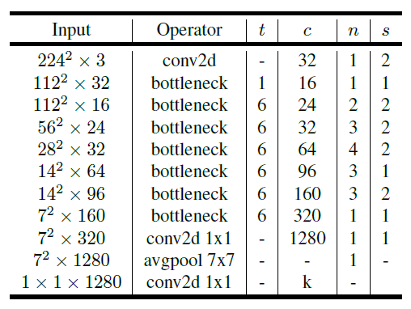
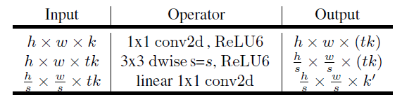
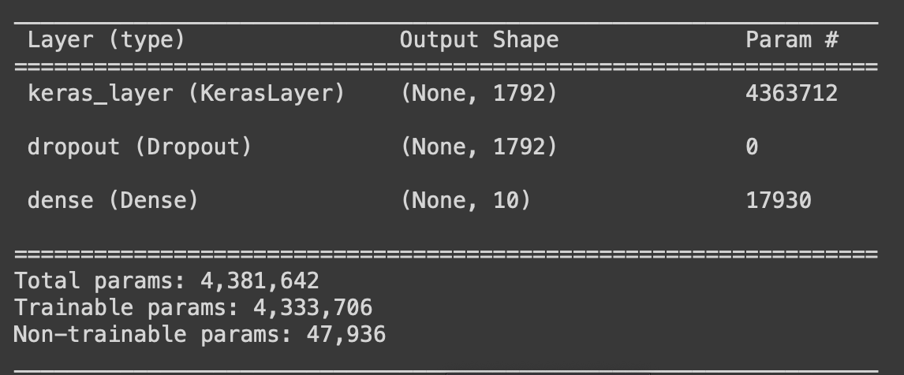
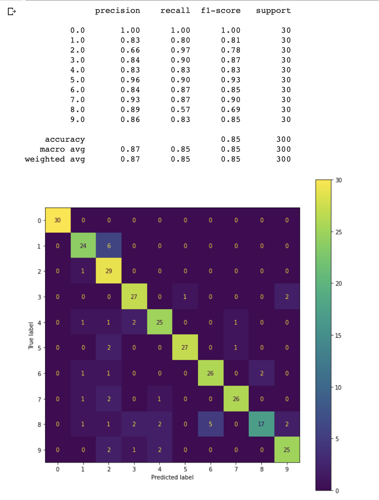

---
language:
- en
license: 
- mit
library_name: 
- mobilenetv2
tags:
- CNN
- image-classification
- architectural-recognizion
metrics:
- accuracy
---

# Model Card for the "Architectural Style Recognition CNN"

## Table of Contents
- [Model details](#model-details)
- [Parameters](#parameters)
- [Resources](#resources)
	- [Related Works](#related-works)
- [License](#license)
- [Contacts](#contacts)
- [Intended use](#intended-use)
- [Factors](#factors)
- [Metrics](#metrics)
- [Training Data](#training-data)
	- [Motivation](#motivation)
	- [Preprocessing](#preprocessing)
- [Caveats and recommendations](#caveats-and-recommendations)

# Model details

- Authors: Andrea Basile, Roberto Lorusso, Antonio Iacovazzi, Emanuele Pomponio

- Model date: 28 June 2022

- Model Version: 2.2.3

- Model Type: CNN based on Mobile-NetV2 architecture.

The model we used in our project is composed by 4 Layers:

- Input layer: used for establish the shape of input, in this case an image 224 x 224 x 3

- MobileNetV2: MobileNet is a pretrained CNN, suited for devices with low computational resources. We retrained all the parameters of this network in order to get better accuracy. Below it is reported the architecture of MobileNetV2:

- Dropout layer: randomly sets input units to 0 with a frequency of rate at each step during training time, which helps prevent overfitting.

- Dense layer: the dense layer performs a matrix- vector multiplication. The output generated by the dense layer is an 10 dimensional vector in order to obtain the classification through the activation function "softmax".

Where every bottleneck layer has the following internal structure: 

The model summary, that enclose the MobileNetV2, is represented below:

<b>Note:</b> keras_layer encloses:
- InputLayer: that takes the 224 x 224 x 3 images.
- MobileNetV2

# Parameters 

The parameters that we will use in our project are:
-  Stochastic Gradient Descent optimizer with a learning rate and momentum.
-  Number of epochs
-  Batch size
-  steps per epoch = train set size / batch size
- validation steps = validation set size / batch size
- Dropout rate
- L2 regularizer

# Resources

The dataset is publicly available from kaggle at:
<a>https://www.kaggle.com/datasets/wwymak/architecture-dataset</a>

## Related Works: 

- Zhe Xu et al. “Architectural Style Classification Using Multinomial Latent Logistic Regression”. In: ECCV. 2014.

- Zhang J. et al Wang B. Zhang S. “Architectural style classification based on CNN and channel spatial attention”. In: SIViP. 2022.

- Mark Sandler et al. “Inverted Residuals and Linear Bottlenecks: Mobile Networks for Classification, Detection and Segmentation”. In: CoRR abs/1801.04381 (2018). arXiv: 1801.04381. url: <a>http://arxiv.org/abs/1801.04381 </a>

- Chi-Feng Wang. A Basic Introduction to Separable Convolutions. 2018 url: <a>https://towardsdatascience.com/ a-basic-introduction-to-separable-convolutions-b99ec3102728</a>

# License 

MIT License

# Contacts

Further details can be given at the following contacts:   

- a.basile99@studenti.uniba.it
- r.lorusso62@studenti.uniba.it
- a.iacovazzi6@studenti.uniba.it
- e.pomponio@studenti.uniba.it

# Intended use

The principal stakeholders are generic users with the intent of recognizing an architectural style. The model will be made available through a user-interface developed with a Telegram chat bot. 
Another context of usage can be the didactic one, as every organization can access to the chat bot. 

# Factors

The training and validation phases are made by using only images captured at daylight time. In the test phase there could be low accuracy associated to night images.

All the experiments were carried out on Google Colab platform with the following setting:

- Python 2.7
- TensorFlow 2.8.0
- GPU Hardware Accelerator

# Metrics
The metrics used in this project are:
- Confusion Matrix
- Accuracy: around 85%
- Recall: how many styles are correctly classified over false negatives and true positive (TO-DO)
- Precision: how many styles are correctly classified over all positive predicted samples (TO-DO)

# Training data 

- Training Data (Orignal Dataset - 30 images for each class used for Test Set).
	- 70% is used as Training Set.
	- 30% is used as Validadtion Set.

Below we report links for dataset and dataset card:
- <a href='https://www.kaggle.com/datasets/wwymak/architecture-dataset'>dataset link</a>
- <a href='https://github.com/se4ai2223-uniba/architectural-style-recognition/blob/main/data/README.md'>dataset card link</a>

## Motivation 

The main motivation behind the choice of the dataset is that it is the largest publicly available data set for architectural style classification.

## Preprocessing

Since the dataset was highly unbalanced, we decided to perform both data balancing and data augmentation. The goals of these decisions are: 

- Equally represented classes with 450 images each,
- Mapping features of the classes regardless of the eventual presence of noise in the images. 

Data balancing is performed by duplicating images in the classes. 
Data augmentation is performed by appliying the following transformations on the training images: 

- Resizing: all original images have different size so, the resizing step is applied in order to have same size for all images (224 x 224 x 3).

- Re-scaling normalization: Neural networks pro- cess inputs using small weight values, and inputs with large integer values can disrupt or slow down the learning process. As such it is good practice to normalize the pixel values so that each pixel value has a value between 0 and 1.

- Mean-STD Normalization: Data normalization is an important step in the training process of a neural network. By normalizing the data to a uniform mean of 0 and a standard deviation of 1, faster convergence is achieved.

- Random-rotation

- Random-scaling

- Random-zoom

# Quantitative Analysis

The overall accuracy is of 85% on 300 test images.
Other metrics can be observed directly from the image below. 

# Caveats and Recommendations

Since the model was trained on a limited number of architectural styles, the predictions can be wrong when the model tries to classify unseen architectural styles, classifying the image with the most similar one. 
The informations gained after its use must be verified by trustful sources. 

Since architectural styles can enclose many other styles, the predicitons can be sensitive to this kind of characteristics.

As mentioned before night images can suffer of low accuracy in the process of prediction, we suggest to run predictions on images captured at day light time. 